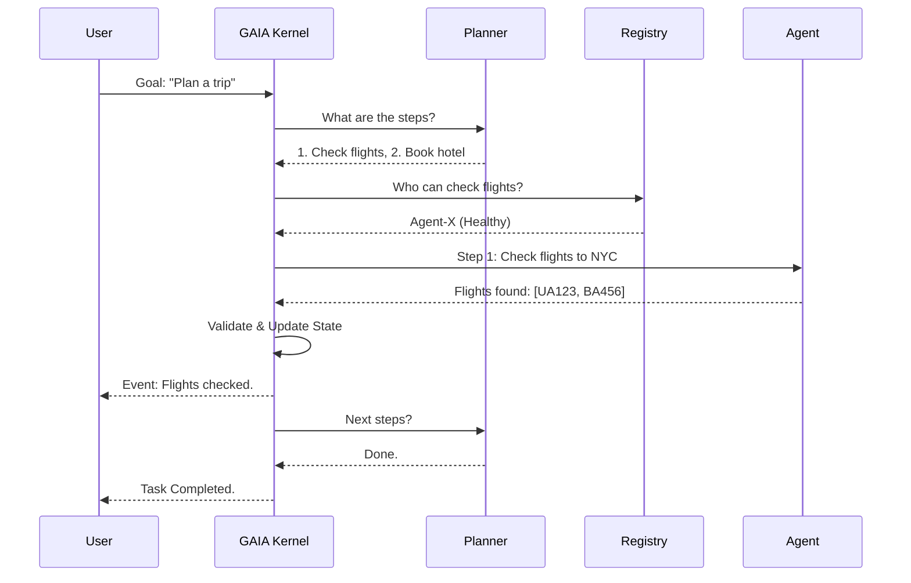

# Chapter 0: The Journey of a Goal

This handbook explains the end-to-end flow of how a natural language goal is transformed into a completed objective by the GAIA Kernel and its ecosystem of agents.

---

## 1. The Cast of Characters

Before we start the journey, let's meet the players:

*   **The User**: Provides the high-level intent (The Goal).
*   **The Kernel (GAIA)**: The "Brain" and "Firewall". It orchestrates everything but does no "real" work itself.
*   **The Planner**: A specialized LLM-based component inside the Kernel that thinks in steps.
*   **The Registry**: A catalog of every agent and what they are capable of.
*   **The Agent**: A specialist tool (e.g., Weather, Email, Database) that executes specific steps.

---

## 2. The 10-Phase Journey

### Phase 1: Submission (The Handshake)
The User sends a POST request to `/api/v1/tasks` with a goal: *"Organize a meeting with Vishal for tomorrow."*
The Kernel validates the request, assigns a `task_id`, and stores it in the **State Store**.

### Phase 2: Planning (The Strategy)
The Kernel looks at the Goal and the **Registry**. It asks the **Planner**: *"How do we do this using the available agents?"*
The Planner returns a **Plan**:
1.  Check Vishal's calendar.
2.  Find an open slot.
3.  Send a calendar invite.

### Phase 3: Scheduling (The DAG)
The Kernel's **Scheduler** analyzes the plan. It builds a **Dependency Graph (DAG)**. 
*   Can we check the calendar and find a slot at the same time? No, Step 2 depends on Step 1.
*   The Scheduler marks Step 1 as "Ready".

### Phase 4: Interpolation (The Data Binding)
Before sending a step to an agent, the Kernel resolves any variables. 
If Step 2 needs the output of Step 1, it uses the syntax `{{step_1.output.busy_slots}}`. The Kernel swaps this marker for real data.

### Phase 5: Policy Check (The Firewall)
The **Policy Engine** checks the step against safety rules:
*   *"Is this agent allowed to access Vishal's calendar?"*
*   *"Does this action require human approval?"*
If it fails, the journey stops here to protect the system.

### Phase 6: Dispatch (The Request)
The Kernel selects the "healthiest" agent that can "Read Calendars" and sends a formal **Request**. 
The communication is strictly one-way: Kernel → Agent.

### Phase 7: Execution (The Action)
The **Agent** receives the request, performs the work (e.g., calling the Google Calendar API), and returns a **Response**.
The Agent never knows about the overall goal; it only knows its specific step.

### Phase 8: Validation (The Contract)
The Kernel receives the agent's response. It **immediately** checks the data against a **JSON Schema**. 
If the agent was supposed to return a list of dates but returned a string instead, the Kernel rejects it as a "Hard Failure".

### Phase 9: State Update (The Memory)
The Kernel updates the **Active State** with the new results. It records the journey in the **Audit Log** and emits an event (e.g., `STEP_COMPLETED`) to the WebSocket stream so the user can see progress in real-time.

### Phase 10: Completion or Re-planning
The Kernel checks: *"Is the goal finished?"*
*   **Yes**: Task status becomes `completed`.
*   **No**: Return to **Phase 2** to plan the next set of steps based on what we just learned.

---

## 3. Key Guarantees

1.  **Deterministic**: If an agent gives the same answer, the Kernel always makes the same decision.
2.  **Isolated**: Agents cannot talk to each other. They only talk to the Kernel.
3.  **Traceable**: Every single step, policy check, and agent response is logged with a timestamp and a hash.
4.  **Resilient**: If an agent fails, the Kernel can retry, try a different agent, or ask the planner for a new strategy.

---

## 4. Visualizing the Flow

