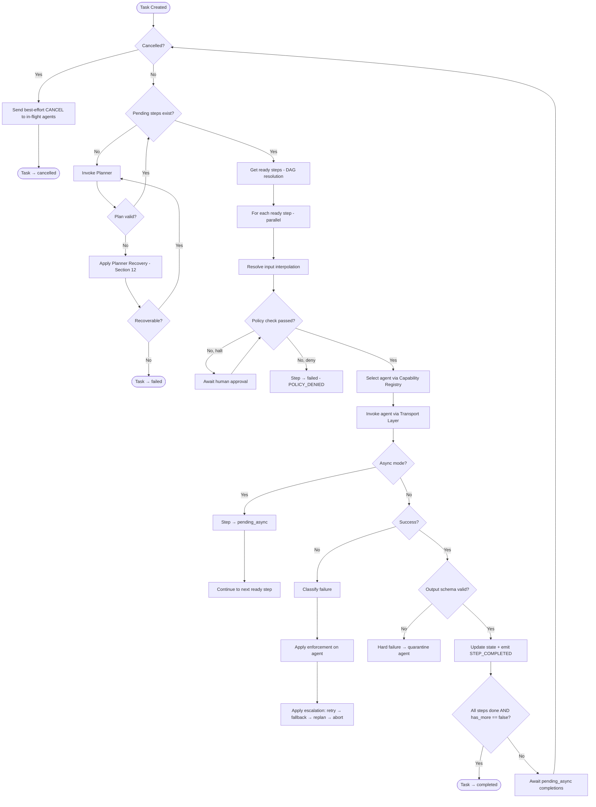

# Control Loop Specification

> **Status**: 🟢 Complete
>
> **Source**: [design.md — Sections 5.2, 6, 7, 8, 10, 11, 12, 16, 17, 18](../design.md)

---

## Purpose

This document provides an **implementation-ready specification** of the GAIA kernel's control loop — the "heartbeat" of the entire system. It expands the pseudocode from design.md Section 16 into formal logic with error handling, concurrency rules, timing constraints, and cross-references to every schema and lifecycle involved.

The control loop is the **only** code path through which work is executed. There are no shortcuts, no bypass paths, and no alternative execution models.

---

## Kernel Invariants

These invariants must hold at **all times** during loop execution. Violating any invariant is a kernel bug.

1. **Progress Guarantee**: Every loop iteration must either complete a step, transition to a replan/failure state, or yield to an async wait. Infinite busy-loops are forbidden.
2. **State Consistency**: No state update shall occur without a corresponding audit log entry and event emission.
3. **Atomic Transitions**: Task and Step status changes must be atomic. Partial or "in-between" states shall never be visible to the Event Bus or external clients.
4. **Deny-by-Default**: No step shall be dispatched without passing the Policy Engine validation phase.
5. **Schema Enforcement**: Every input sent to an agent and every output received from an agent must be validated against the declared JSON Schema. Non-conforming data is a hard failure.
6. **Deterministic Processing**: Given the same plan and the same agent responses, the kernel must produce the same state transitions (design.md Section 18).

---

## Loop Architecture (Mermaid)



---

## Phase 1: Loop Entry

### 1.1 Trigger

The control loop starts when a new Task is created via the Client API (`POST /tasks`).

### 1.2 Pre-conditions

| Condition | Enforced by |
| :--- | :--- |
| `task.status == pending` | Goal Manager |
| `task.goal` is a non-empty string | Request schema validation |
| `task.task_id` is a valid UUID | Request schema validation |
| At least 1 agent is registered | Capability Registry |

### 1.3 Entry Actions

1. Transition Task: `pending → planning`. Emit `TASK_PLANNING`.
2. Assemble planner input (see Phase 2).

---

## Phase 2: Planning

### 2.1 Planner Input Assembly

The planner receives a curated context window containing:

| Input | Source | Schema Reference |
| :--- | :--- | :--- |
| Goal | `task.goal` (immutable) | Task schema |
| Active State | State Store — Tier 1 (hot) | Snapshot schema |
| Latest Snapshot | State Store — Tier 2 (warm) | Snapshot schema |
| Capability Manifest | Capability Registry — names + descriptions only | AgentManifest.capabilities |
| Failure Context | Only present on replan: the error that triggered replanning | Error schema |

**Data minimization rule** (design.md Section 5.3): The planner never sees agent IDs, raw agent outputs, or full task history. It operates on the capability abstraction.

### 2.2 Planner Output Validation

The planner must return a valid PlanRecord (schemas.md Section 11):

| Check | Failure Mode | Recovery |
| :--- | :--- | :--- |
| Response is valid JSON | Malformed output | Retry once with stricter prompt |
| `steps` array has ≥ 1 element | Empty plan | `TASK_FAILED("planner returned empty plan")` |
| Every `step.capability` exists in Registry | Hallucinated capability | Reject plan, retry with filtered manifest |
| `depends_on` forms a valid DAG (no cycles) | Circular dependency | Reject plan, retry |
| `has_more` is boolean | Schema violation | Retry once |

### 2.3 Planner Failure Recovery (design.md Section 12)

```text
attempt = 0
while attempt < MAX_PLANNER_RETRIES (default: 3):

    result = planner(goal, state, capabilities)

    if timeout or rate_limit:
        attempt++; backoff; continue

    if malformed output:
        attempt++; retry with stricter prompt; continue

    if empty plan:
        emit TASK_FAILED("planner returned empty plan"); return

    if hallucinated capability:
        attempt++; retry with filtered manifest; continue

    if valid:
        create PlanRecord(status: "valid"); emit PLAN_GENERATED; break

if all retries exhausted:
    emit TASK_FAILED("planner unavailable"); return
```

### 2.4 Post-Planning

1. Create PlanRecord: `status → valid`. Emit `PLAN_GENERATED`.
2. Transition Task: `planning → executing`. Emit `TASK_EXECUTING`.
3. Proceed to Phase 3.

---

## Phase 3: Step Scheduling (DAG Resolution)

### 3.1 Ready Step Algorithm

```text
function get_ready_steps(plan):
    ready = []
    for step in plan.steps:
        if step.status == "pending":
            if all(dep.status == "done" for dep in step.depends_on):
                ready.append(step)
    return ready
```

### 3.2 Parallelism Rules

| Rule | Value | Rationale |
| :--- | :--- | :--- |
| Max concurrent steps | Configurable (default: 10) | Prevents resource exhaustion |
| Max concurrent steps per agent | Configurable (default: 3) | Prevents overloading a single agent |
| Dispatch order | Topological (DAG order) | Ensures dependencies are respected |

### 3.3 No Ready Steps

If `get_ready_steps()` returns empty AND there are steps with `status == pending`:
- This means pending steps depend on failed/incomplete steps.
- Trigger escalation (Phase 8).

---

## Phase 4: Input Resolution (Interpolation)

### 4.1 Interpolation Sources (priority order)

| Pattern | Source | Example |
| :--- | :--- | :--- |
| `{{step_id.output.field}}` | Output of a completed step | `{{step_1.output.url}}` |
| `{{state.field}}` | Active State (Tier 1) | `{{state.user_email}}` |
| `{{const.field}}` | Task metadata constants | `{{const.api_key_ref}}` |

### 4.2 Resolution Rules

1. Only steps with `status == done` can be referenced.
2. If a reference cannot be resolved → Step fails with `EXECUTION_FAILED("unresolvable interpolation: {{step_3.output.missing}}")`.
3. Circular references are impossible if Phase 3 correctly enforces the DAG.
4. Interpolation is performed by the **Kernel**, not by the agent. The agent receives fully resolved input.

---

## Phase 5: Policy Check

### 5.1 Pre-Dispatch Validation (design.md Section 5.2)

For each step, before dispatch:

| Check | Source | Failure |
| :--- | :--- | :--- |
| Agent auth valid | AgentManifest.auth | `POLICY_DENIED` |
| Agent scopes include capability | AgentManifest.auth.scopes | `POLICY_DENIED` |
| Input passes input_schema | Capability.input_schema | `SCHEMA_VIOLATION` |
| Capability constraints allowed | Policy Engine rules | `POLICY_DENIED` |
| Cost/budget within limits | Policy Engine rules | `POLICY_DENIED` — halt |
| Human approval required? | Policy Engine rules | Pause → await approval |

### 5.2 Human-in-the-Loop

When a policy rule requires human approval:
1. Task remains in `executing` state.
2. Step remains in `pending` state.
3. Kernel emits a `STEP_APPROVAL_REQUIRED` event via the Event Bus.
4. Loop yields (does not block — other ready steps may proceed).
5. When approval is received, the step re-enters the dispatch queue.

---

## Phase 6: Dispatch & Invocation

### 6.1 Agent Selection

```text
agent = registry.select(
    capability = step.capability,
    constraints = step.constraints,
    scoring = health × SLA × trust_score × policy
)

if no agent available:
    step → failed (AGENT_UNAVAILABLE)
    proceed to Phase 8 (escalation)
```

### 6.2 Mode Selection

| Condition | Mode |
| :--- | :--- |
| Agent `invoke.async_supported == false` | `sync` |
| Agent `invoke.async_supported == true` AND step has no dependents waiting | `async` preferred |
| Per-step override in policy | Overrides agent preference |

### 6.3 Invocation

1. Build Request (schemas.md Section 4): `type`, `request_id`, `from`, `task_id`, `step_id`, `capability`, `input`, `mode`, `timeout_ms`.
2. Route through Transport Layer (native / A2A / MCP adapter based on `agent.protocol`).
3. Step: `pending → running`. Emit `STEP_STARTED`.
4. Start timeout timer: `step.timeout_ms ?? agent.invoke.timeout_ms`.

### 6.4 Sync Path

- Block until response received or timeout.
- Proceed to Phase 7.

### 6.5 Async Path

- Agent returns ACK: `{ "success": true, "job_id": "xyz" }`.
- Step: `running → pending_async`.
- Store `job_id` for correlation.
- Loop continues to next ready step (does not block).

---

## Phase 7: Result Processing

### 7.1 Output Validation

```text
if response.success == true:
    if validate(response.output, capability.output_schema):
        step.output = response.output
        step.status = "done"
        update_state(response.output)
        emit STEP_COMPLETED
    else:
        # Output is structurally invalid → hard failure
        step.status = "failed"
        step.error = { code: "SCHEMA_VIOLATION", message: "..." }
        enforce(agent, "quarantine")  # immediate quarantine
        emit STEP_FAILED
else:
    # Agent reported failure
    step.error = response.error
    proceed to Phase 8
```

### 7.2 State Update

1. Merge `step.output` into the Active State (Tier 1).
2. Append the step result to the Task History (Tier 2).
3. Check snapshotting triggers (State Management Spec):
   - Step count threshold reached?
   - State size exceeds limit?
4. Update `task.current_step`.
5. Update `task.updated_at`.

### 7.3 Metrics Recording

Update the assigned agent's `AgentRecord.rolling_metrics`:
- Increment success count.
- Record `response.metrics.duration_ms` in latency percentiles.
- Recalculate `trust_score`.

---

## Phase 8: Failure Handling

### 8.1 Failure Classification (design.md Section 10.1)

| Category | Examples | Retryable? |
| :--- | :--- | :--- |
| Soft failure | Timeout, transient network error | Yes |
| Hard failure | Schema violation, malformed output | No (quarantine agent) |
| Policy violation | Unauthorized action attempt | No (blacklist agent) |

### 8.2 Agent Enforcement (design.md Section 10.2)

Applied **immediately** upon failure classification:

| Failure Type | Agent Action | AgentRecord Transition |
| :--- | :--- | :--- |
| Repeated timeouts | Degrade priority (emit `AGENT_DEGRADED`) | `active → degraded` |
| Schema violation | Quarantine (emit `AGENT_QUARANTINED`) | `active/degraded → quarantined` |
| Policy violation | Blacklist (emit `AGENT_BLACKLISTED`) | `any → blacklisted` |

### 8.3 Escalation Path (design.md Section 8.3)

```text
if error.retryable AND step.retry_count < retry_policy.max_attempts:
    if capability.idempotent OR NOT capability.constraints.mutates_state:
        step.retry_count++
        step.assigned_agent = null   # allow re-selection
        step.status = "pending"      # re-enter dispatch queue
        apply backoff delay
    else:
        # Non-idempotent, state-mutating → unsafe to retry
        proceed to fallback

if fallback agent available for step.capability:
    step.assigned_agent = fallback_agent
    step.status = "pending"

elif replan_allowed:
    # A replan is allowed if:
    # 1. replan_count < MAX_REPLANS (increments each time task enters planning)
    # 2. AND PlanRecord.generation < 2 (enforced by schema)
    task.status = "planning"         # re-enter Phase 2
    PlanRecord.status = "replanning"
    emit REPLAN_TRIGGERED

else:
    task.status = "failed"
    emit TASK_FAILED
```

---

## Phase 9: Async Completion Handling

### 9.1 Tracking

The kernel maintains an async completion table:

| Field | Type | Description |
| :--- | :--- | :--- |
| `task_id` | UUID | Parent task |
| `step_id` | string | The async step |
| `job_id` | string | Agent-provided tracking ID |
| `agent_id` | string | The assigned agent |
| `timeout_at` | datetime | Deadline for completion |

### 9.2 Completion Event

When the agent sends a completion event:

```text
on async_completion(task_id, step_id, job_id, output):
    validate job_id matches stored record
    validate output against capability.output_schema
    step.output = output
    step.status = "done"
    emit STEP_COMPLETED
    resume control loop for task
```

### 9.3 Async Timeout

```text
if current_time > timeout_at:
    step.status = "failed"
    step.error = { code: "TIMEOUT", retryable: true }
    emit STEP_FAILED
    proceed to Phase 8 (escalation)
```

---

## Phase 10: Loop Termination

### 10.1 Success

```text
if all steps in plan have status == "done" AND plan.has_more == false:
    task.status = "completed"
    task.finished_at = now()
    emit TASK_COMPLETED
```

### 10.2 Incremental Planning

```text
if all steps in plan have status == "done" AND plan.has_more == true:
    task.status = "planning"   # re-enter Phase 2
    emit TASK_PLANNING
    # Planner is invoked with updated state including results of completed steps
```

### 10.3 Failure

```text
if escalation reaches "abort":
    task.status = "failed"
    task.finished_at = now()
    emit TASK_FAILED
```

### 10.4 Cancellation

```text
on INTERRUPT(task_id, reason):
    for each in-flight step:
        send CANCEL(task_id, step_id) to assigned agent (best-effort)
        step.status = "failed"
    task.status = "cancelled"
    task.finished_at = now()
    emit TASK_CANCELLED
```

---

## Agent Lifecycle Hooks (Outside the Task Loop)

These event handlers run independently of any specific task:

### Registration

```text
on agent_connect(manifest):
    1. Validate manifest against AgentManifest schema
    2. Auth check (verify credentials)
    3. Assign sandbox profile (network rules, resource limits)
    4. Register capabilities in Capability Registry
    5. AgentRecord.status = "active"
    6. Emit AGENT_REGISTERED
```

### Disconnect

```text
on agent_disconnect(agent_id):
    1. Stop routing new steps to this agent (DRAIN)
    2. Reassign in-flight steps to fallback agents (REASSIGN)
    3. Remove capability bindings from Registry (DEREGISTER)
    4. AgentRecord.status = "disconnected"
    5. Emit AGENT_DISCONNECTED
```

### Health Monitoring

```text
every HEALTH_CHECK_INTERVAL (default: 30s):
    for each agent with status in ["active", "degraded"]:
        result = ping(agent.health_endpoint)
        update rolling_metrics
        recalculate trust_score

        if consecutive_failures > HEALTH_THRESHOLD:
            AgentRecord.status = "disconnected"
            reassign in-flight steps
            emit AGENT_EJECTED
```

---

## Timing Constraints

| Parameter | Default | Configurable? |
| :--- | :--- | :--- |
| Max loop iteration time | 60s | Yes |
| Max planner retries | 3 | Yes |
| Max replan count per task | 2 | Yes |
| Health check interval | 30s | Yes |
| Health failure threshold | 3 consecutive | Yes |
| Default step timeout | 15000ms | Yes (via agent manifest) |
| Max concurrent steps | 10 | Yes |

---

## Concurrency Rules

1. **Task-level lock**: The control loop holds a lock on the Task during status transitions. Two loop iterations for the same Task must not run concurrently.
2. **Step-level parallelism**: Multiple ready steps within a single Task may execute concurrently (up to `max_concurrent_steps`).
3. **Agent-level concurrency**: An agent may serve multiple steps from different Tasks concurrently (up to `max_concurrent_per_agent`).
4. **Event ordering**: Events for a single Task must be emitted in causal order. Events across Tasks have no ordering guarantee.

---

## Related Documents

* [Data Model & Schemas](schemas.md) — all schemas referenced in this spec (Task, Step, Request, Response, Error, PlanRecord, AgentRecord, Snapshot)
* [Lifecycle State Machines](lifecycles.md) — valid status transitions driven by this loop
* [Failure Handling Spec](failure-handling.md) — retry, escalation, enforcement details
* [Planning Spec](planning.md) — planner interface and interpolation engine
* [Registry Spec](registry.md) — agent selection and routing algorithm
* [Transport Spec](transport.md) — invocation and protocol adapters
* [Security Spec](security.md) — policy checks and sandbox enforcement
* [State Management Spec](state-management.md) — tiered storage and snapshotting triggers

---

## TODO

- [x] Convert pseudocode to formal flowchart (Mermaid)
- [x] Define all 10 loop phases with formal logic
- [x] Document concurrency limits and thread safety rules
- [x] Document timing constraints with defaults
- [x] Cross-reference all schemas and lifecycle transitions
- [x] Document agent lifecycle hooks (registration, disconnect, health)
- [x] Add async completion handling with job_id correlation
