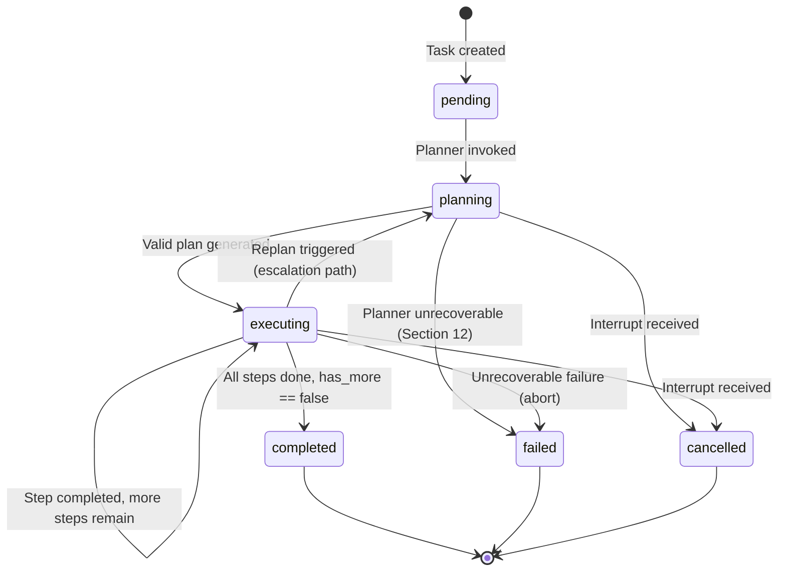
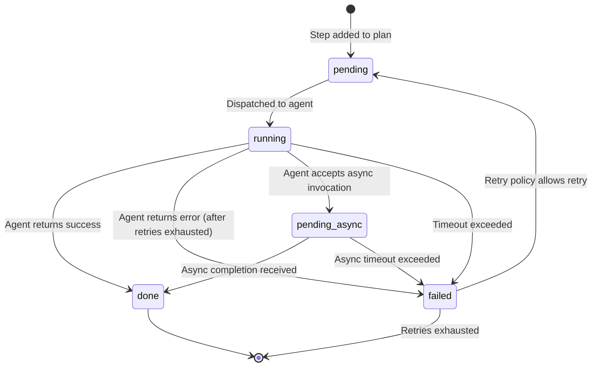
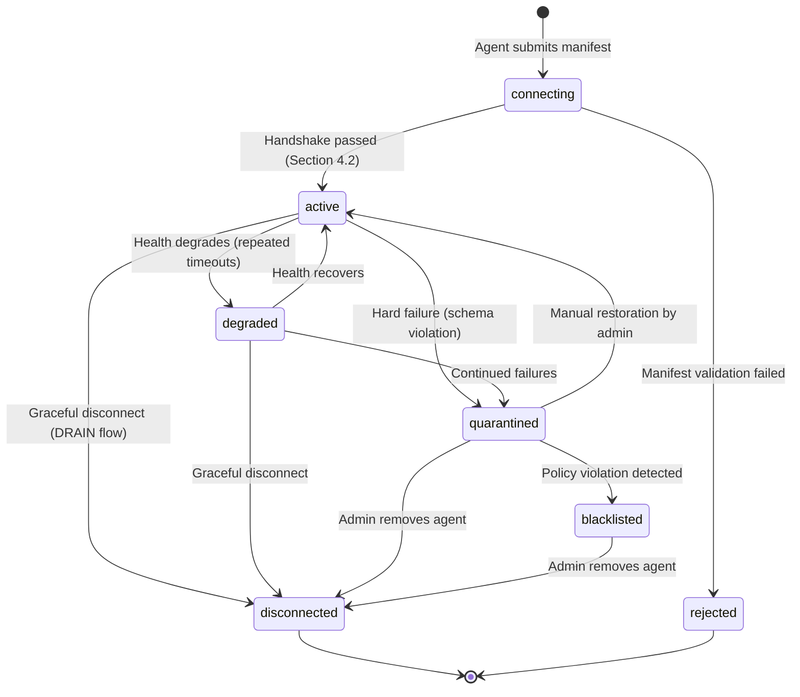
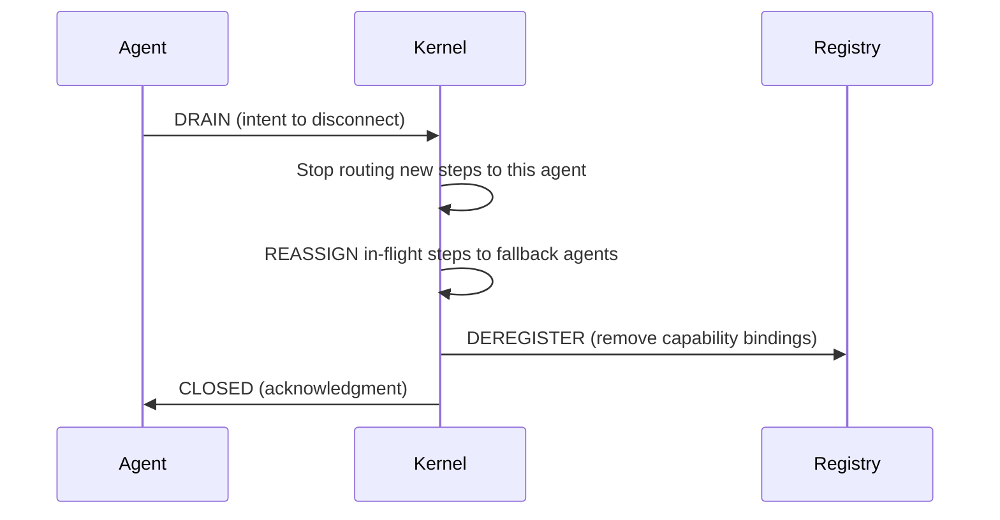
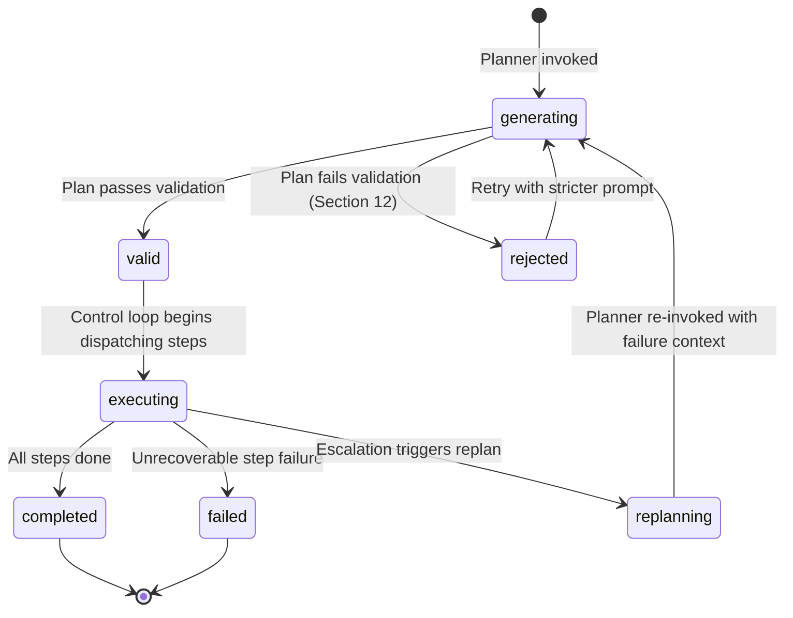

# Lifecycle State Machines

> **Status**: 🟢 Complete
>
> **Source**: [design.md — Sections 2.1, 4.2, 4.3, 8.3, 9.1, 9.2, 9.3, 10, 11, 12, 16](../design.md)

---

## Purpose

This document defines the **formal state machines** for every stateful entity in the GAIA kernel. Each state machine specifies the valid states, legal transitions, triggers, guard conditions, and invariants. These state machines are the **law** — any transition not listed here is illegal and must be rejected by the kernel.

---

## 1. Task Lifecycle

A Task represents a user's goal from submission to completion.

### 1.1 State Diagram

### 1.2 Transition Table

| From | To | Trigger | Guard |
| :--- | :--- | :--- | :--- |
| `pending` | `planning` | Control loop begins | Task exists in State Store |
| `planning` | `executing` | Planner returns valid plan | Plan passes schema + capability validation |
| `planning` | `failed` | Planner exhausts retries | All recovery strategies in Section 12 exhausted |
| `planning` | `cancelled` | `INTERRUPT` event received | `reason == user_cancel \| system_shutdown` |
| `executing` | `executing` | Step completes, more pending | `plan` has steps with `status != done` |
| `executing` | `planning` | Replan triggered | Escalation path reaches "replan" (Section 8.3) |
| `executing` | `completed` | Last step finishes | All steps `status == done` AND `has_more == false` |
| `executing` | `failed` | Unrecoverable failure | Escalation path reaches "abort" (Section 8.3) |
| `executing` | `cancelled` | `INTERRUPT` event received | Best-effort `CANCEL` sent to in-flight agents |

### 1.3 Terminal States

`completed`, `failed`, and `cancelled` are **terminal**. Once a Task enters a terminal state, no further transitions are allowed. The Task becomes read-only.

### 1.4 Invariants

1. A Task must have exactly one active status at any time.
2. `goal` is immutable after creation. It must never be modified.
3. `plan` must never be empty when status is `executing`.
4. `updated_at` must be set on every transition.
5. `finished_at` must be set on entry into any terminal state.

### 1.5 Edge Cases

| Scenario | Behavior |
| :--- | :--- |
| Cancel received during `planning` | Planner call is abandoned. Task → `cancelled`. |
| Cancel received during `executing` with in-flight steps | Best-effort `CANCEL` sent to agents. Steps marked `failed`. Task → `cancelled`. Kernel does NOT wait for agent acknowledgment. |
| Replan from `executing` → `planning` and planner fails | Task → `failed`. The replan is the last chance. |
| All steps complete but planner says `has_more == true` | Task stays in `executing`. Planner is invoked again for next batch. |

---

## 2. Step Lifecycle

A Step is a single unit of work within a Task's plan.

### 2.1 State Diagram

### 2.2 Transition Table

| From | To | Trigger | Guard |
| :--- | :--- | :--- | :--- |
| `pending` | `running` | Kernel dispatches step | All `depends_on` steps are `done`; policy check passed |
| `running` | `done` | Agent returns `success: true` | Output passes `output_schema` validation |
| `running` | `failed` | Agent returns `success: false` | Error classified; retries may follow |
| `running` | `failed` | `timeout_ms` exceeded | Agent did not respond in time |
| `running` | `pending_async` | Agent accepts async mode | `invoke.async_supported == true` on agent |
| `pending_async` | `done` | Async result received | Output passes `output_schema` validation |
| `pending_async` | `failed` | Async timeout exceeded | No result within allowed window |
| `failed` | `pending` | Retry triggered | `retry_count < retry_policy.max_attempts` AND `error.retryable == true` |

### 2.3 Terminal States

`done` is the **success terminal**. `failed` is the **failure terminal** only when retries are exhausted. If retries remain and the error is retryable, `failed` transitions back to `pending`.

### 2.4 Invariants

1. A Step can only enter `running` if ALL steps in `depends_on` are `done`.
2. `output` must only be set when status is `done`.
3. `error` must only be set when status is `failed`.
4. `retry_count` must increment on every `failed → pending` transition.
5. `assigned_agent` must be set when entering `running` and cleared on `failed → pending` (agent may change on retry).

### 2.5 Edge Cases

| Scenario | Behavior |
| :--- | :--- |
| Step depends on a failed step (retries exhausted) | Step remains `pending` forever. Task-level escalation (replan or abort) handles this. |
| Output passes schema but fails semantic check by planner | Step is marked `done` (structurally valid). Planner may issue a new corrective step in the next plan iteration. |
| Task cancelled while step is `running` | Kernel sends best-effort `CANCEL` to agent. Step → `failed`. |
| Task cancelled while step is `pending_async` | Kernel stops polling. Step → `failed`. |
| Non-idempotent step with `mutates_state: true` fails | Retry is **blocked** unless explicit retry policy overrides the default. Step → `failed` immediately. |

---

## 3. Agent Lifecycle

An Agent represents a registered capability provider tracked by the Capability Registry.

### 3.1 State Diagram

### 3.2 Transition Table

| From | To | Trigger | Guard |
| :--- | :--- | :--- | :--- |
| `connecting` | `active` | Manifest passes validation | Schema valid, auth verified, sandbox assigned |
| `connecting` | `rejected` | Manifest fails validation | Invalid schema, duplicate agent_id, or auth failure |
| `active` | `degraded` | Repeated timeouts | `rolling_metrics.success_rate` drops below threshold |
| `active` | `quarantined` | Schema violation | Agent returns output that fails `output_schema` validation |
| `active` | `disconnected` | Agent sends DRAIN signal | DRAIN → REASSIGN → DEREGISTER → CLOSED (Section 4.3) |
| `degraded` | `active` | Health recovers | `rolling_metrics.success_rate` rises above threshold over N checks |
| `degraded` | `quarantined` | Continued failures | Consecutive failures exceed hard limit |
| `quarantined` | `active` | Admin restores agent | Manual intervention via admin API |
| `quarantined` | `blacklisted` | Policy violation | Unauthorized action attempt, data exfiltration, etc. |
| `blacklisted` | `disconnected` | Admin removes agent | Manual intervention only |
| Any | `disconnected` | Health check fails repeatedly | Crash detection: agent unreachable after N consecutive health checks |

### 3.3 Enforcement Actions (from design.md Section 10.2)

| Condition | Action | Target State |
| :--- | :--- | :--- |
| Repeated timeouts | Degrade priority | `degraded` |
| Schema violations | Immediate quarantine | `quarantined` |
| Policy violation | Blacklist | `blacklisted` |
| Crash / health down | Temporary eject | `disconnected` |

### 3.4 Terminal States

`disconnected` and `rejected` are terminal. A disconnected agent can reconnect by submitting a new manifest (re-entering `connecting`).

`blacklisted` is **semi-terminal**: the agent cannot self-recover. Only an admin can transition it to `disconnected` to allow re-registration.

### 3.5 Invariants

1. An agent in `quarantined` or `blacklisted` status must NEVER be selected by the Capability Registry for dispatch.
2. An agent in `degraded` status has reduced priority but remains eligible for dispatch when no better alternative exists.
3. `trust_score` must be recalculated on every health check and after every step completion/failure.
4. The DRAIN → REASSIGN → DEREGISTER → CLOSED flow must complete atomically. No new steps may be assigned after DRAIN is initiated.

### 3.6 Graceful Disconnect Flow (Section 4.3)

### 3.7 Edge Cases

| Scenario | Behavior |
| :--- | :--- |
| Agent crashes without sending DRAIN | Kernel detects via failed health checks. In-flight steps are failed and retried with a different agent. Agent → `disconnected`. |
| New agent registers for an already-served capability | Both agents co-exist. Registry selects based on trust score, latency, and health. |
| Quarantined agent's in-flight steps | Steps are immediately failed and reassigned. Agent receives no new work. |
| Agent reconnects after being disconnected | Fresh handshake. Old AgentRecord is archived. New AgentRecord starts with default trust_score. |

---

## 4. Plan Lifecycle

A Plan is the structured set of Steps generated by the Planner for a Task. Plans are managed implicitly through the Task lifecycle but have their own internal states.

### 4.1 State Diagram

### 4.2 Transition Table

| From | To | Trigger | Guard |
| :--- | :--- | :--- | :--- |
| `generating` | `valid` | Planner returns plan | Plan passes schema validation AND all referenced capabilities exist in Registry |
| `generating` | `rejected` | Planner returns invalid plan | Malformed JSON, empty plan, or hallucinated capability |
| `rejected` | `generating` | Retry | Retry count < max planner retries (Section 12) |
| `valid` | `executing` | Control loop picks up ready steps | At least one step has all `depends_on` satisfied |
| `executing` | `completed` | All steps `done` | `has_more == false` |
| `executing` | `failed` | Escalation reaches "abort" | Retry → fallback → replan all exhausted |
| `executing` | `replanning` | Escalation reaches "replan" | Step failure triggers replan per escalation path (Section 8.3) |
| `replanning` | `generating` | Planner re-invoked | Failure context + remaining goal passed to planner |

### 4.3 Plan Validation Rules (Section 12)

| Failure Mode | Recovery |
| :--- | :--- |
| LLM timeout / rate limit | Retry with backoff (max 3 attempts) |
| Malformed output (non-JSON) | Retry once with stricter prompt |
| Empty plan (zero steps) | `TASK_FAILED("planner returned empty plan")` |
| Hallucinated capability | Reject plan, retry with filtered manifest |
| All retries exhausted | `TASK_FAILED("planner unavailable")` |

### 4.4 Invariants

1. A Plan must contain at least one Step to be `valid`.
2. All capabilities referenced in the Plan must exist in the Capability Registry at validation time.
3. The Plan's dependency graph must be a valid DAG — circular dependencies are rejected at validation.
4. Replanning must preserve completed steps. Only pending/failed steps may be replaced.

---

## Cross-Cutting Concerns

### Concurrency Rules

1. **Task status transitions are atomic.** The kernel must hold a lock on the Task during status changes to prevent race conditions from parallel step completions.
2. **Step status transitions within a Task may occur concurrently** (parallel steps), but each individual Step transition is atomic.
3. **Agent status transitions are independent** of Task/Step transitions and are driven by the health monitoring subsystem.

### Event Emission

Every state transition must emit the corresponding event to the Event Bus:

| Entity | Transition | Event |
| :--- | :--- | :--- |
| Task | → `planning` | `TASK_PLANNING` |
| Task | → `executing` | `TASK_EXECUTING` |
| Task | → `completed` | `TASK_COMPLETED` |
| Task | → `failed` | `TASK_FAILED` |
| Task | → `cancelled` | `TASK_CANCELLED` |
| Step | → `running` | `STEP_STARTED` |
| Step | → `done` | `STEP_COMPLETED` |
| Step | → `failed` | `STEP_FAILED` |
| Agent | → `active` (first time) | `AGENT_REGISTERED` |
| Agent | → `degraded` | `AGENT_DEGRADED` |
| Agent | → `quarantined` | `AGENT_QUARANTINED` |
| Agent | → `blacklisted` | `AGENT_BLACKLISTED` |
| Agent | → `disconnected` (ejection) | `AGENT_EJECTED` |
| Agent | → `disconnected` (graceful) | `AGENT_DISCONNECTED` |
| Plan | → `valid` | `PLAN_GENERATED` |
| Plan | → `rejected` | `PLAN_REJECTED` |
| Plan | → `replanning` | `REPLAN_TRIGGERED` |

---

## Related Documents

* [Data Model & Schemas](schemas.md) — schema definitions for Task, Step, AgentRecord
* [Control Loop Spec](control-loop.md) — how the loop drives state transitions
* [Failure Handling Spec](failure-handling.md) — agent degradation and quarantine triggers
* [Registry Spec](registry.md) — registration and disconnect flows
* [Event Catalog](../reference/event-catalog.md) — all event types with payload definitions

---

## TODO

- [x] Define Task state machine with Mermaid diagram
- [x] Define Step state machine with Mermaid diagram
- [x] Define Agent state machine with Mermaid diagram
- [x] Define Plan state machine with Mermaid diagram
- [x] Document all edge cases and race conditions
- [x] Cross-reference with Control Loop (design.md Section 16)
- [x] Map state transitions to Event Catalog
