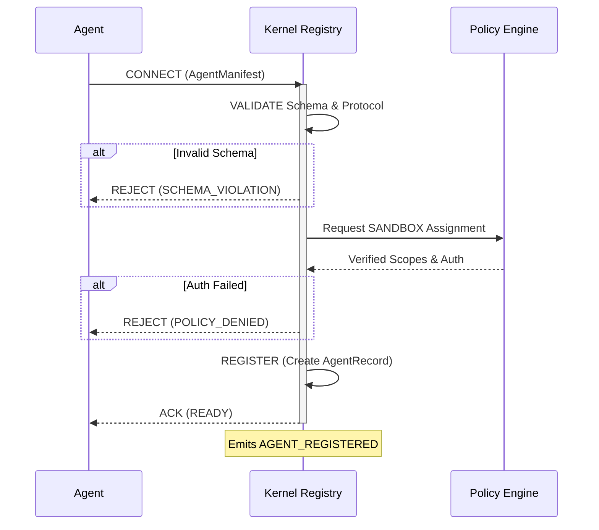

# Capability Registry Specification

> **Status**: 🟢 Complete
>
> **Source**: [design.md — Sections 4, 6.5](../design.md)

---

## Purpose

This document specifies the **Capability Registry** — the authoritative directory and routing engine of the GAIA kernel. It maps abstract capabilities to concrete, registered agents. It covers the exact handshake for registration, the graceful disconnect flow, and the Dispatcher's scoring algorithm for agent selection.

---

## 1. Registry Data Model

The Registry maintains two primary indexes in memory (backed up to Tier 2 Warm storage).

### 1.1 Capability Index (Primary)
A mapping of `Capability Name` → `Set<AgentID>`.
This enforces **Capability Primacy**: The kernel routes tasks based on *what* needs to be done, not *who* does it.

### 1.2 Agent Metadata Index (Secondary)
A mapping of `AgentID` → `AgentRecord` (see schemas.md Section 8).
Tracks the live state of every connected agent:
* `status`: Current lifecycle state (`active`, `degraded`, etc.)
* `trust_score`: Rolling health composite [0.0, 1.0]
* `last_health_check`: Timestamp for heartbeat tracking
* `auth`: Validated scopes and sandbox assignments

---

## 2. Registration Flow (The Handshake)

When an agent attempts to join the GAIA network, it must pass a strict 4-stage handshake (design.md Section 4.2).

### Handshake Rules
1. The kernel strictly validates the `AgentManifest` against Draft 2020-12 JSON Schemas.
2. Capability names must match the regex `^[a-z0-9_.-]+$`.

### Re-registration Behavior
When an agent with an existing `agent_id` reconnects and re-registers:
1. **In-flight Steps**: Continue on the old agent process without interruption.
2. **Capabilities**: Old capability bindings are removed, new ones are added (version mismatch possible if updated).
3. **Auth**: Old credentials revoked, new ones validated.
4. **Rolling Metrics**: PRESERVED (`success_rate`, `p95_latency_ms`).
5. **Trust Score**: Recalculated from preserved metrics.
6. **New AgentRecord**: Overwrites the active connection record; old connection transitions to `disconnected`.

---

## 3. Deregistration & Drain Flow (design.md Section 4.3)

Agents may leave the network gracefully or be forcibly ejected due to health check failures.

### 3.1 Graceful Disconnect (DRAIN)
1. Agent sends a `DRAIN` signal. Status transitions `active → disconnected`.
2. The Registry immediately removes the agent from the Capability Index (no new requests routed).
3. The kernel reassigns any `pending` steps assigned to this agent.
4. Any `running` steps are allowed to finish up to their timeout.
5. Emits `AGENT_DISCONNECTED`.

### 3.2 Forced Ejection
If the Kernel's health monitor fails to reach the agent's `health_endpoint` 3 consecutive times:
1. Status transitions to `disconnected`.
2. All `pending` and `running` steps are immediately marked `failed` (triggering the retry/fallback escalation path).
3. Emits `AGENT_EJECTED`.

---

## 4. Agent Selection Algorithm (The Dispatcher)

When a step enters the `pending` state, the Dispatcher queries the Registry to select the optimal agent (design.md Section 6.5).

### 4.1 Eligibility Filter
1. Query Capability Index for the requested capability.
2. Filter out any agents where `status != active` (Note: `degraded` agents are only considered if no `active` agents exist).
3. Filter out agents lacking the required `auth.scopes` for the task context.

### 4.2 Scoring Formula
Eligible agents are ranked by a dynamic Dispatcher Ranking Score:

$$ Ranking Score = (Trust Score \times 0.6) + (Latency Score \times 0.3) + (Transport Bonus \times 0.1) $$

* **Trust Score**: Taken directly from the `AgentRecord` (max 1.0).
* **Latency Score**: `1.0 - (Agent p95_latency / Global Avg Latency)`. Bounded to [0.0, 1.0].
* **Transport Bonus**: 
  * `1.0` if transport is `ipc` or `native` (local execution preference).
  * `0.5` if transport is `grpc` or `websocket`.
  * `0.0` if transport is `http`.

### 4.3 Fallback Chain
If the primary selected agent fails (or timeouts) during execution:
1. The Dispatcher selects the next highest-scoring agent from the eligible pool.
2. If the pool is empty, the Dispatcher expands the filter to include `degraded` agents.
3. If still empty, the step fails with `CAPABILITY_NOT_FOUND`, triggering a task replan (failure-handling.md).

---

## 5. Hot-Swap & Versioning

The Registry supports dynamic hot-swapping to ensure zero-downtime upgrades.

1. **Seamless Upgrades**: A new agent version (`1.1.0`) can connect while the old version (`1.0.0`) is still serving. 
2. **Version Precedence**: If two agents offer the exact same capability but have different versions, the Dispatcher routes traffic to the higher semantic version by default (assuming equal trust scores).
3. **In-Flight Steps**: Steps already `running` are never interrupted during a hot-swap. They complete on the older version.

---

## Related Documents

* [Data Model & Schemas](schemas.md) — AgentManifest and AgentRecord schemas
* [Lifecycle State Machines](lifecycles.md) — Agent status transitions
* [Transport Spec](transport.md) — Native, IPC, and HTTP protocol definitions
* [Failure Handling Spec](failure-handling.md) — Trust score calculation details
* [Control Loop Spec](control-loop.md) — Dispatcher integration (Phase 6)

---

## TODO

- [x] Define registry data model and indexes formally.
- [x] Document the 4-stage CONNECT → REGISTER handshake.
- [x] Specify graceful DRAIN vs forced ejection logic.
- [x] Define Agent Selection scoring algorithm and transport bonuses.
- [x] Document Hot-Swap behavior and version precedence.
